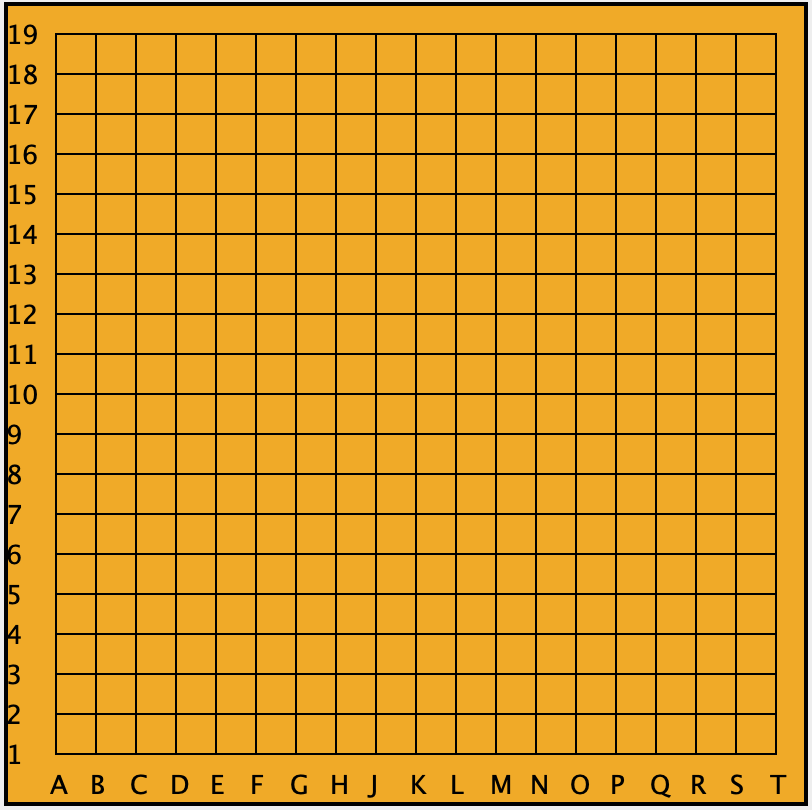

# JAVA API for CONNSIX

## About
This API is for Connect Six programs developed with the Java Programming language. Its functions connect and communicate with the single mode server.

## Functions
* public ConnectSix(String ip, int port, String color)
* public String letsConnect(String ip, int port, String color)
* public String drawAndRead(String draw)
* public String query(String position)
#### Please refer to the javadoc for specific information.

## Coordinate
The coordinate is consisted with an alphabet character and a number. The columns are notated with 'A'~'T' with 'I' not included. The rows are notated with 1~19. The one digit numbers should have a leading 0.
 
Below is an image that explains the coordinate system. 

